# Granny's Pantry

## Index - Table Of Contents
1. [General Information](#general-info)
2. [User Experience & Design](#ux)
3. [Features](#features)
4. [Technologies Used](#tech-used)
5. [Testing](#testing)
6. [Deployment](#deployment)

## General Information
 This is a simple cooking website with a twist. All of the recipes are traditional family recipes passed down through generations. When deciding on a topic for this project, I consulted with my mentor who advised me to choose something I am passionate about. I love to cook and bake so a recipe website was a given. I came to the conclusion that a simple recipe website was too basic, so I approached the task from a different viewpoint. Ancestry is something that is also very important to me, and to many others too. The infusion of the two has the potential to amass a very specific client, middle-aged women especially. 

 This website contains all the bones of a classic web page, fixed menu bar, footer with social media links and an eye-catching hero image. Aside from the usual, it has a treasure of varying elements, from the image links to the details element underneath, the standard form, slideshow, and even an embedded video. It showcases an array of my talents and is also enjoyable for the user as it's easy to navigate and provides feedback throughout the website.

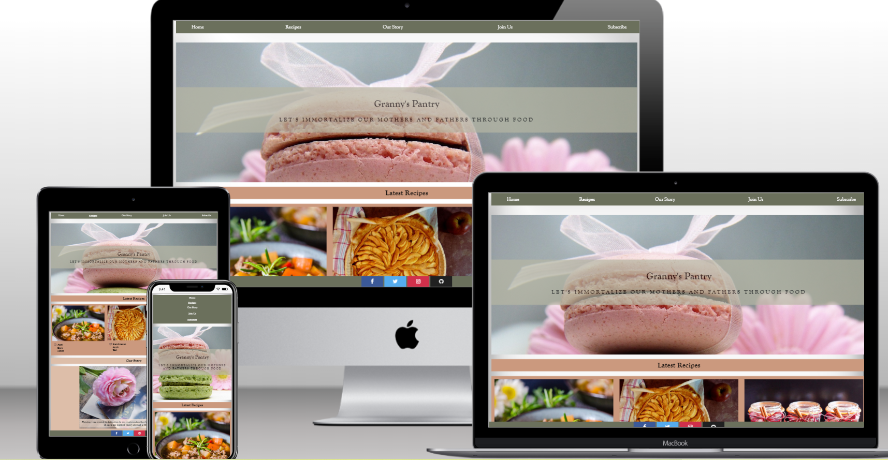

 

 ## User Experience

 **Site Goals**

 1. As A Shopper 

* I want to cook something different.
* I want to publish or simply share old family recipes.
* I want to do something to honour my loved ones.
* I want to find new and interesting recipes.
* I want to immdetiately have an understanding of the site's purpose.
* I want to be able to become a subscriber and recieve extra recipes.

2. As The Site Administrator
* I want the website to have a simple layout yet offer value at the same time.
* The website and embedded websites load fast.
* Information is easy to find.
* I want the site to be aesthetically pleasing, using soft contrasting colours.
* I want interactive elements to be available throughout the website in order to keep the clients engaged.

## Design

*Imagery*

* First and foremost I had to have images that were free to use. [Free use images site](https://pixabay.com/)

* Upon the advice of my mentor, I saved all of the images to my desktop and made a folder specifically to store them, just incase the website removes the images.

* The large background image chosen for the header centers on a pretty-pink macaron wrapped in a bow. I chose this image because it is delicate and neat. The colours match that of the chosen colour palette. This is the first image the client sees upon opening the page, and highlights the fact that this a website centered around food. On mobile devices you can see the earthy green macaron in the chosen image. The green colour also coincides with the webpage.

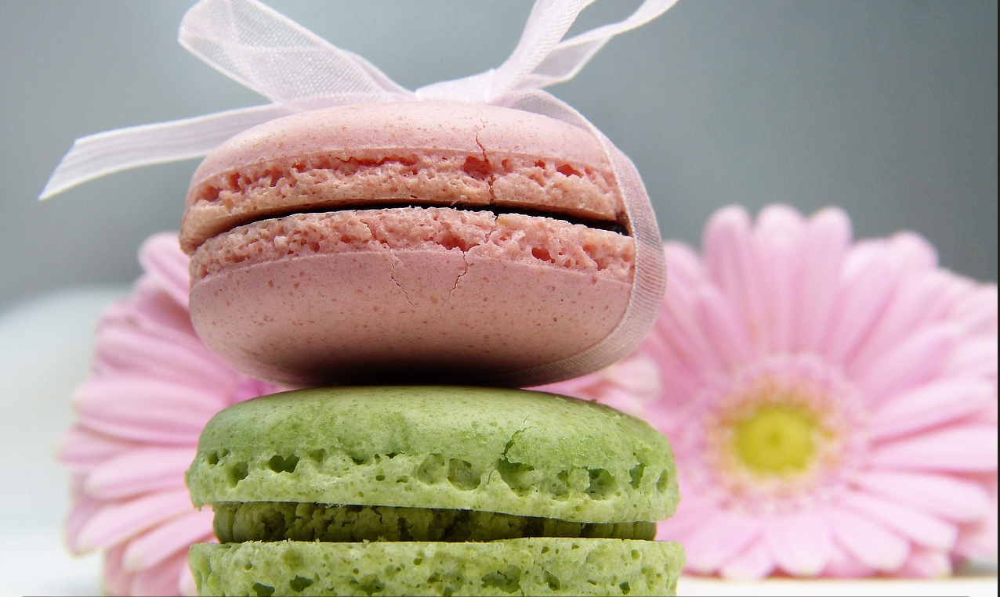

* For the recipe images, I needed to be sure they were relevant to the recipes but also high quality and enticing to the client. 

* The mince image looks homely and rustic and I liked the flowers in the background as flowers are seen throughout the websites imagery. 

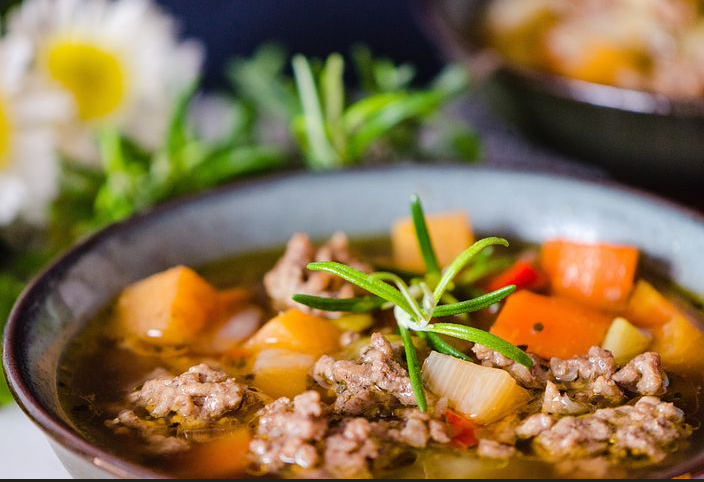

* The tart image appears in the center column as its spiral design is captivating and the most interesting of the three. The plaid cloth reinforces that bucolic atmosphere I wanted. The final jam image has ribbons similar to the header image.

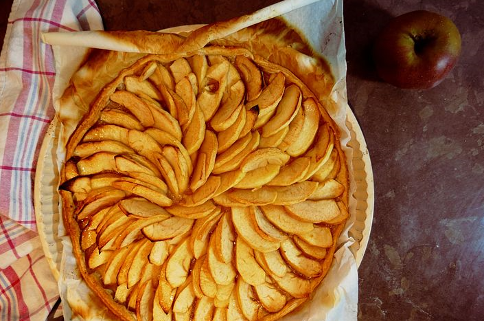

* The jars are dainty and cute, supporting the overall delicate mood. Although they differ, the recipe images collaborate effectively.

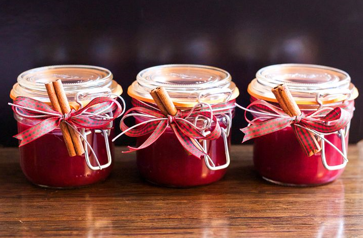

* It was imperative that the slideshow images fortified the historical element of the website. I wanted old fashioned images, with a pink tone to concur with the 
chosen colour palette. The first slide shows a black and white female photograph, tenderly covered by a pink rose. The image is relevant to the text and the theme. The second slide displays several black and white photographs, pink roses, pink macarons and a coffee cup sitting on a notepad. The photos are comparative to the first slide, and increase the old fashioned, historical vibe. The pink roses are also cohesive with the first slide and the pink macarons relate to the header. The coffee cup boosts the food aspect. The notepad relates to the documentation mentioned in the text. The final slide contains pink blossoms and a pocket watch that sits on an old ribbon-wrapped book. The blossoms fit beautifully with the previous florals seen in the site and the pocket watch is antiquated and historical. The book is old fashioned and sets forth the emphasis of ribbons as we have already seen.

* The join us image is relative to the slideshow images as it contains the pink flowers and ancient photgraphs. The documents in the background of the image are superannuated, coinciding nicely with the previous images. 

*Colour Scheme*

* Before I chose my colour scheme, I researched the [colour feelings](https://99designs.com/blog/tips/how-color-impacts-emotions-and-behaviors/) and moods different colours can evoke in people. I knew I wanted a calming colour, hence why I chose the green. I chose pink aswell because it's sweet and pleasant. The pink and green together create the perfect balance of playfullness and relaxation. My target audience being middle aged women, I feel these colours are perfect together. 

* Knowing now the colours I wanted to produce, I used a [colour palette picker](https://coolors.co/palettes/palettes) for inspiration. I found a pink and green palette that was very popular and chose it.

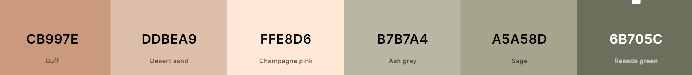

*Typography*

* When choosing the typography I utilised a [font finder](https://www.tutorialbrain.com/css_tutorial/css_font_family_list/) and picked 'Goudy Old Style' and 'garamond' as a fallback. These styles are easily decipherable.

*Wireframes*

[Desktop Wireframe](https://share.balsamiq.com/c/eRyq9zWhpvd4kyeK8tic1k.png)

[Tablet Wireframe](https://share.balsamiq.com/c/cSJ9UT15kyTGe83DG9XBsD.png)

[Mobile Wireframe](https://share.balsamiq.com/c/aWx7BUeaMpMMzobfDcfAzw.png)

 

 ## Features

 **Existing Features**

 **F01 Navigation Bar**

 * The navigation bar is immediately accessible upon landing on the page. The colours coincide with the colour palette throughout the website. It includes Home, Recipes, Our Story, Join Us, and Subscribe links that are also responsive, on small screens the links stack vertically. The menu has an interactive element as it changes colour when the mouse hovers over each link. It also has a fixed element on so it is always easily accessible to the client. 

 * I understood how imperative the menu is for users and that is why it was incorporated. It allows clients to navigate easily through the website.

 * This same navigation bar is repeated throughout all of the embedded webpages, to ensure continuity.

 

 **F02 Header**

 * The header provides us with a delicate photograph of a macaron wrapped in pink ribbon, the earthy green macaron underneath is only visible on mobile but alas it coincides with the chosen hues of the website.. The colours of the image intertwine neatly with the websites overall palette. I also chose this image because it lets the client envision that the goal of the webiste is orientated to the food industry.

 * I wanted to ensure the text did not get lost in the image so I added a slightly opacified background to the text alone. It makes the text more legible.

 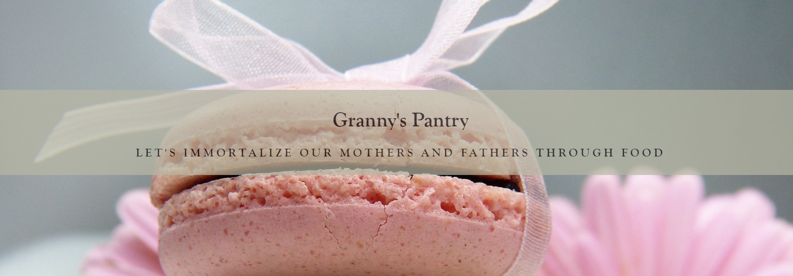

 **F03 Tagline**

 * The chosen tagline "Let's immortalize our mothers and fathers through food" sums up the tone and premise of the website. I think the use of a tagline will strengthen the client's memory of the brand itself.

 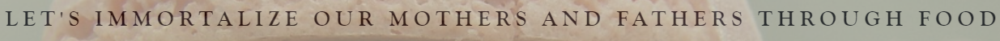

 **F04 Recipe Links**

 * The latest recipes section appears above the fold, which is imperative to maintain the user's interest and ensure they keep scrolling. 

 * I chose to add a recipe section because it is the most important premise of the website and what majority of clients will be interested in, hence why it is the first subsection under the hero image.

 * I decided on a triple column affect as it is eye pleasing for the user. It allows the server to showcase three varying recipes that give an indication of what the food section entails, that being various contrasting recipes.

 * This section contains a details element that when clicked, displays a short sentence on each dish. The details element is also interactive, changing colour when the user hovers over the title.

 * On mobile the recipe links stack vertically instead, to ensure the details elements are not overlapping.

 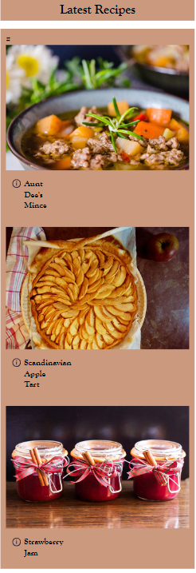

 * The background colour coincides with the soft, motherly-pink tone of the website.

 * I think the overall design of this section is simple yet extremely eye pleasing and effective.

 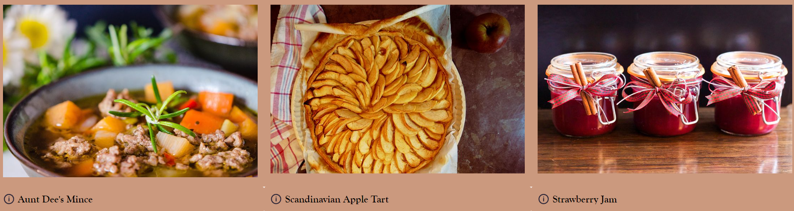

 * When the user clicks the recipe image, they are directed to a new web page. These pages contain a brief historical background on the recipe, ingredients and instructions list too. The menu and footer bars and identical to that of the homepage.

 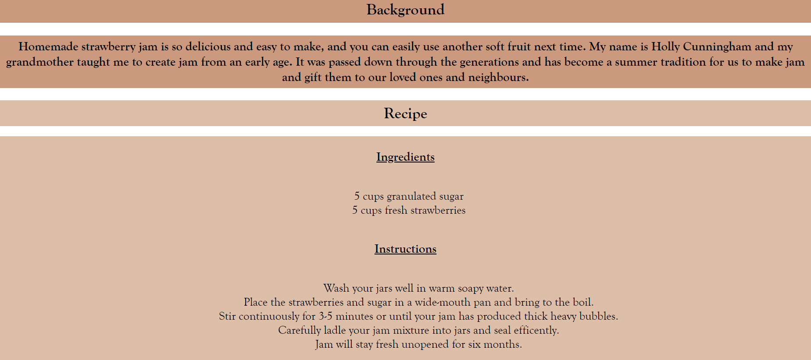

 **F05 Slideshow**

 * The slideshow feature allows me to convey a lot of information in a way that ensures the user does not feel overwhelmed, drip feeding the information with each slide instead of displaying the text in one large block.

 * I decided to use old-fashioned images, keeping in line with the theme of lineage. I was determined that the photos had to have a hint of pink and grey to match my colour palette.

 * The slides gradually fade onto the screen, emphasising the gentle tone felt throughout the website.

 * The text on the slides contains a slightly opaque background ensuring legibility.

 * The slides arrow buttons contain an interactive element as they change colour when the mouse hovers over them.

 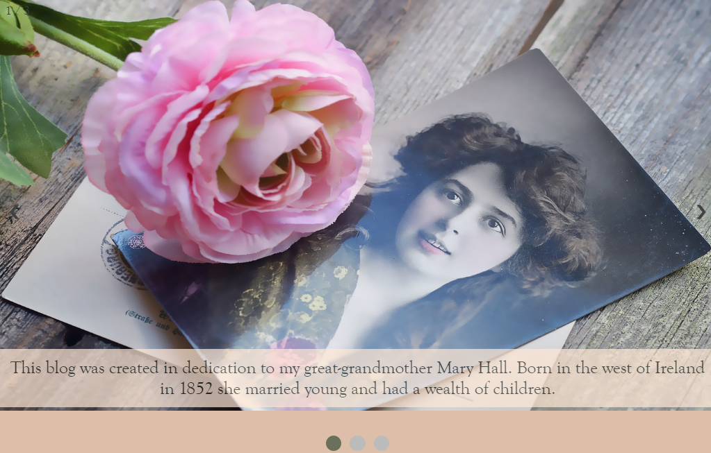

 **F07 Join Form**

 * This form feature allows clients to honour their families by sharing their recipes. This establishes a continuous connection between the user and the site.

 * The form entails a zig-zag layout that coincides with the nexts section.

 * All inputs are required for submission.

 * The background colour is a baby pink shade, reinforcing the inherently sweet and charming feeling of the site.

 * The image to the right of the form relates to the images used in the slideshow, ensuring cohesiveness.

 * The join form allows the users to share their recipes and become an integral part of the website.

 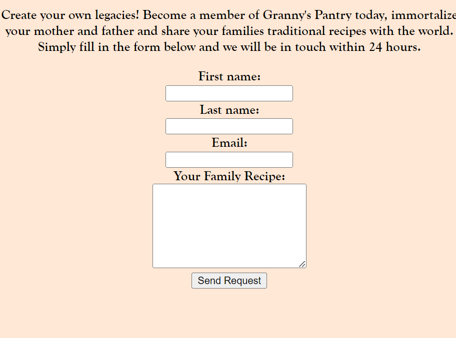

 * When you press the submit button with your personal information, you are taken to a new thank you window, further emphasizing interaction.

 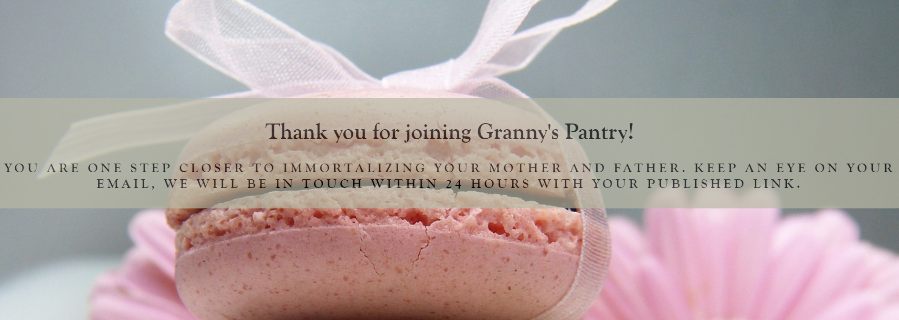

 **F06 Embedded Video**

 * The youtube video element adds another media component to the site, essentially entertaining the client and adding value.

 * The zig-zag layout is seen here again, with both media elements at opposing sides.

 * The video does not play automatically, but can be viewed and paused in the webpage. It consists of an old fashioned Ukranian recipe.

 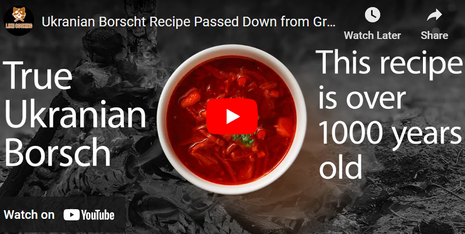

 **F07 Subscriber Form**

 * This submission form like the previous one, is interactive. When submitted, the client is taken to a new page confirming subscription.

 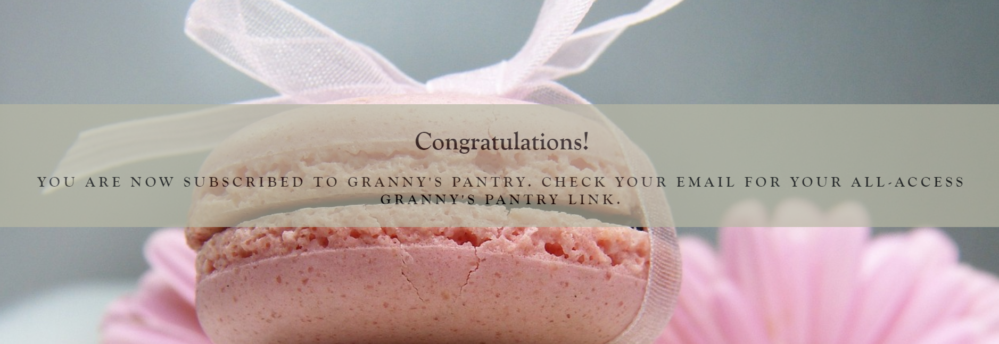

 * The background color is a light-grey shade. The grey adds a more professional feeling to the site, contrasting with the emotive pinks, and coincides with the header and footer.

 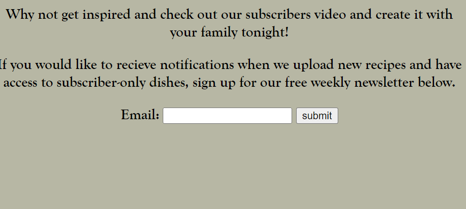

 * The subscriber form allows users to recieve email notifications when new recipes are uploaded and access subscriber-only recipes.

 **F08 Footer**

 * The footer is the same shade of green as the header, guaranteeing a congruous layout.

 * I decided the use of familiar social media icons was a better option than text. They are a common visual language, improve visual interest and provide functionality and feedback.

 * Throughout various screen sizes, they remain centered.

 * When the user hovers over the icons, they change colour, establishing interaction.

 

 * When you click on the icons, you are taken to the homepage of each respected website.

**F09 Error 404 Page**

* The error 404 page was added just incase any links and/or pages are broken on the site.

* It has a button that gives the user the option to return to the homepage.

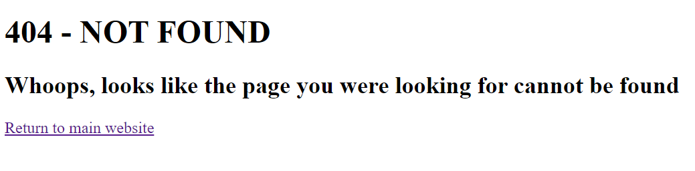

**F10 Favicon Icon**

* I decided to add a favicon icon that contains the "GP" that stands for Granny's Pantry.

* The colours of the icon coincide with the website's colour palette.

* I wanted to add the icon because it helps the user identify the web page more easily in the browser tab. It is important for brand recognition.

 ## Technologies Used
 
 **Languages Used**

 * [HTML5](https://en.wikipedia.org/wiki/HTML5)
 * [CSS3](https://en.wikipedia.org/wiki/CSS)
 * [Javascript](https://en.wikipedia.org/wiki/JavaScript)

 **Frameworks, Libraries & Programs Used**

 * [W3Schools](https://www.w3schools.com/howto/howto_css_fixed_menu.asp) was used to make my menu fixed.

 * [Tutorial Brain](https://www.tutorialbrain.com/css_tutorial/css_font_family_list/) helped me find fonts.

 * [W3Schools](https://www.w3schools.com/howto/howto_css_images_side_by_side.asp) helped me position my images using flex.

 * [CSS-Tricks](https://css-tricks.com/exploring-what-the-details-and-summary-elements-can-do/) was used to style the details element.

 * [W3Schools](https://www.w3schools.com/howto/howto_css_three_columns.asp) aided me in the layout of the details element.

 * [W3Schools](https://www.w3schools.com/html/html_forms.asp) was utilised to create my forms.

 * [Font Awesome](https://fontawesome.com/search?q=social%20media&o=r) provided me with icons for my footer element.

 * [W3Schools](https://www.w3schools.com/howto/howto_css_social_media_buttons.asp) gave me icon style inspiration.

 * [Pagedart](https://pagedart.com/blog/how-to-link-javascript-to-html/) helped me link my javascript file to my html file for the slideshow.

 * [W3Schools](https://www.w3schools.com/howto/howto_js_slideshow.asp) assisted in the making of my slideshow.

 * [Coding Dude](https://www.coding-dude.com/wp/css/highlight-text-css/#:~:text=Simple%20CSS%20Highlight%20Text%20Effect%20Besides%20the%20%3Cmark%3E,the%20same%20thing%20as%20the%20HTML%20%3Cmark%3E%20tag.) benefitted me in highlighting the text in the slideshow.

* [W3Docs](https://www.w3docs.com/snippets/html/how-to-create-an-anchor-link-to-jump-to-a-specific-part-of-a-page.html) guided me into making my menu links jump to different parts of the page.

* [W3Schools](https://www.w3schools.com/tags/tag_img.asp) was availed of in order to make my image links.

* [Good Cookery](http://www.godecookery.com/twotarts/twotarts.html) gave me inspiration for the scandinavian pie recipe.

* [Epicurious](https://www.epicurious.com/recipes/food/views/old-fashioned-raspberry-jam-230700) aided me in creating the old fashioned strawbery jam recipe.

* [Digital Guide](https://www.ionos.com/digitalguide/websites/web-development/readme-file/#:~:text=The%20table%20of%20contents%20can%20be%20structured%20with,IDs%20for%20the%20headlines%20in%20the%20readme%20file.) and [Markdown Guide](https://markdownguide.org/cheat-sheet/) helped me in navigating the readme markdown language.

* [Stack Overflow](https://stackoverflow.com/questions/12717993/stylesheet-not-updating-when-i-refresh-my-site) was beneficial in teaching me the use of Ctrl + f5 in forcing the browser to reload the page, I wasn't seeing my css updates immediately and this solved the issue.

* [Techsini](https://techsini.com/multi-mockup/index.php) created the collage image of my website on multiple devices.

* [W3Schools](https://www.w3schools.com/howto/howto_css_fixed_footer.asp) helped in making the footer fixed to the bottom of the page.

* [W3Schools](https://www.w3schools.com/howto/howto_css_dropdown.asp#:~:text=Use%20any%20element%20to%20open%20the%20dropdown%20menu%2C,to%20position%20the%20dropdown%20menu%20correctly%20with%20CSS.) gave me an example of how to create a dropdown menu like the one I used in the menu bar.

* [Github docs](https://docs.github.com/en/pages/getting-started-with-github-pages/creating-a-custom-404-page-for-your-github-pages-site) aided in creating the 404 error page.

* [Favicon](https://favicon.io/tutorials/how-to-add-a-favicon-to-a-website-ico-format/) showed me how to create a small icon for the browser tab.

* I used slack search to figure out why dragging and dropping my images into a folder was not working. I can upload them if I right click the folder instead.

* I solved footer icon alignment issues with the code institute "footer styling" lesson.

* I recieved an error 501 on my two webpages that display after the forms are filled out. I changed method on forms from post to get to remove the error, which I found out through slack.

* My header background image was not displaying in the GitHub live site, but worked perfectly through port 8000. My peers on slack informed me the issue was a result of using absolute paths instead of relative.

## Testing

I feel as though I have conducted all of the necessary tests to ensure my website works well. All features mentioned work on various screen sizes, and continuously work as intended to. The five linked web pages have caused errors during the creative process, yet these errors have been eradicated and work smoothly ever since. 

**Validator Testing**

* Results for HTML

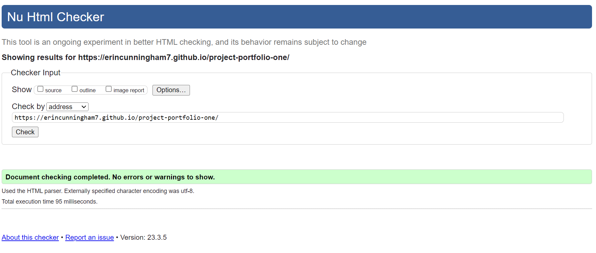

* Results for CSS

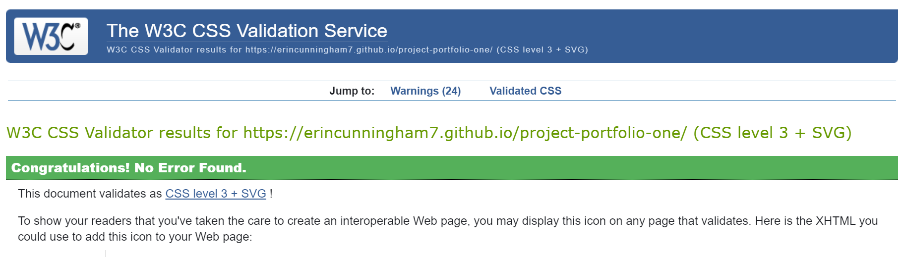

**Browser Compatibility**

 * Testing has been carried out on the following browsers:
 1. Chrome Version 110.0.5481.178 (Official Build) (64-bit)
 2. Firefox Version 110.0.1 (64-bit)
 3. Safari on iOS Version 16.3
 4. Microsoft Edge Version 110.0.1587.63 (Official build) (64-bit)

 **Responsiveness Testing**

Over the course of building this webpage, I have religiously checked how the website looks on my iPhone, Samsung tablet and Lenovo laptop. I have tweaked the responsiveness declarations countless times. On iPhone I came to the conclusion that the menu bar displayed better vertically stacked and therfore not at a fixed position, as it would take up half the screen height. I also decided to change the zig-zag pattern of the two final subsections. It looked too cramped and the images became distorted and hard to decipher, along with the forms overlapping their neighbouring elements. I changed them to a simple block display instead. The grey colours chosen for the website have a hint of green on iPhone but alas it does not take away from the overall visùal effect. I did not have any major problems with the tablet responsiveness, just had to make sure the recipe images aligned nicely in their columns and the menu and footer elements displayed neatly.

1. Open browser and navigate to Granny's Pantry.
2. Open the developer tools (right click and inspect).
3. Set to responsive and decrease width to 320px
4. Set the zoom to 60%
5. Click and drag the responsive window to maximum width

Expected:

Website is responsive on every varying screen size. The images are not overlapping the text. The images are not pixelated.

Actual:

Website behaved as expected.

**Accessibility Testing**

Wave Accessibility was recommended to me by mentor.

Testing was centered around the following:

* The website contains no contrast errors that may affect visually impaired users.

* The website's forms have aria-labels and/or labels to be read by screen readers for interface elements.

* All images have alternate text to present the content of an image to screen reader users.

* All icons with links attached have alternate text to present the purpose of the icons to screen reader users.

* The language of the page has been identified.

* Heading levels are used appropriately.

Accessibility Issues:

1. Contrast errors occcured in the navbar element, so I had to change the text colour and the background colour.

2. A label was not implemented for the last textarea element in the join us form. It was quickly added and the issue was rendered.

* Results for Web Accessibility Evaluation

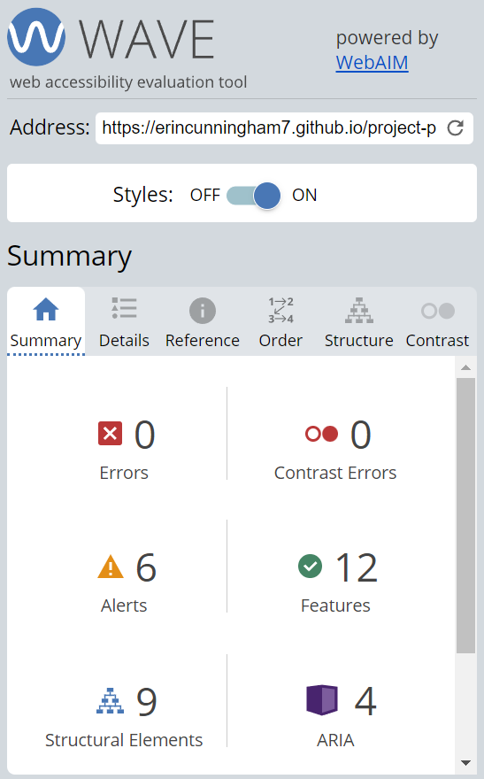

**Functional Testing**

*Navigation Links*

* Testing was executed to ensure all navigation links performed their given task and took users to the correct part of the webpage or to the correct page in a new browser tab. I tested this by clicking on each link.

| Navigation Link |  Page To Load/Section To Jump To |
|:----------------|:--------------------------------:|
| Home             | Hero Image |
| Recipes: Aunt Dee's Mince Recipe |  recipe-one.html     |
| Recipes: Scandinavian Apple Tart | recipe-two.html    |
| Recipes: Strawberry Jam | recipe-three.html |
| Our Story | Our Story slideshow |
| Join Us | Join Us form section |
| Subscribe | Subscribe form section |

* All links worked as intended.

*Recipe Links*

* Testing was performed on the recipe images to ensure when clicked they took the user to the correct page. This was done by clicking on the images.

| Image Link |  Page To Load |
|:-----------|:-------------:|
| Aunt Dee's Mince Image | recipe-one.html |
| Scandinavian Apple Tart | recipe-two.html |
| Strawberry Jam | recipe-three.html |

* All image links worked correctly.

*Forms*
 
* The first form tested was the Join Us form. I needed to be sure the form took the user to a new page when inputted correctly and the submit button would not work when the form was inputted incorrectly.

1. Scenario One - Correct Input

Steps to test:

* Navigate to Granny's Pantry Homepage.

* Scroll down to the Join Us section or use the "Join Us" button on the menu bar.

* Input the following into the form:
First Name: John
Last Name: Doe
Email: john.doe@test.com
Comment: This is a test.

* Click submit.

* User should be redirected to thank-you.html webpage.

Expected:

Form submits with no errors and user is redirected to thank-you.html page.

Actual:

* Website behaved as expected with no errors and redirected to thank-you.html.

2. Scenario Two - Missing Required Field First Name

Steps to test:

* Navigate to Granny's Pantry Homepage.

* Scroll down to the Join Us section or use the "Join Us" button on the menu bar.

* Input the following into the form:
First Name:
Last Name: Doe
Email: john.doe@test.com
Comment: This is a test.

* Click submit.

Expected:

* The form does not submit and 'Please fill out this field' appears under the First Name: input.

Actual:

* Website behaved as expected, the message was displayed and the form did not submit.

3. Scenario Three - Missing Required Field Last Name

Steps to test:

* Navigate to Granny's Pantry Homepage.

* Scroll down to the Join Us section or use the "Join Us" button on the menu bar.

* Input the following into the form:
First Name: John
Last Name: 
Email: john.doe@test.com
Comment: This is a test.

* Click submit.

Expected:

* The form does not submit and 'Please fill out this field' appears under the Last Name: input.

Actual:

* Website behaved as expected, the message was displayed and the form did not submit.

4. Scenario Four - Missing Required Field Email 

Steps to test:

* Navigate to Granny's Pantry Homepage.

* Scroll down to the Join Us section or use the "Join Us" button on the menu bar.

* Input the following into the form:
First Name: John
Last Name: Doe
Email: 
Comment: This is a test.

* Click submit.

Expected:

* The form does not submit and 'Please fill out this field' appears under the Email: input.

Actual:

* Website behaved as expected, the message was displayed and the form did not submit.

5. Scenario Five - Incorrect Email Format

Steps to test:

* Navigate to Granny's Pantry Homepage.

* Scroll down to the Join Us section or use the "Join Us" button on the menu bar.

* Input the following into the form:
First Name: John
Last Name: Doe
Email: john.doe.test.com
Comment: This is a test.

* Click submit.

Expected:

* The form does not submit and 'Please include an @ in the email address' appears under the Email: input.

Actual:

* Website behaved as expected, the message was displayed and the form did not submit.

6. Scenario Six - No Inputs Enterred

Steps to test:

* Navigate to Granny's Pantry Homepage.

* Scroll down to the Join Us section or use the "Join Us" button on the menu bar.

* Input nothing into the form.

* Click submit.

Expected:

* The form does not submit and 'Please fill out this field' appears.

Actual:

* Website behaved as expected, the message was displayed and the form did not submit.

* The second form tested was the subscribe form to ensure it worked as expected when both the correct and incorrect data was inputted.

1. Scenario One - Correct Input

Steps to test:

* Navigate to Granny's Pantry Homepage.

* Scroll down to the Subscribe section or use the "Subscribe" button on the menu bar.

* Input the following into the form:
john.doe@test.com

* Click submit.

* User should be redirected to the congrats.html webpage.

Expected:

Form submits with no errors and user is redirected to the congrats.html page.

Actual:

* Website behaved as expected with no errors and redirected to congrats.html.

2. Scenario Two - Incorrect Input 

Steps to test:

* Navigate to Granny's Pantry Homepage.

* Scroll down to the Subscribe section or use the "Subscribe" button on the menu bar.

* Input the following into the form:
john.doe.test.com

* Click submit.

Expected:

* The form does not submit and 'Please include an @ in the email address' appears.

Actual:

* Website behaved as expected, the message was displayed and the form did not submit.

6. Scenario Three - No Inputs Enterred

Steps to test:

* Navigate to Granny's Pantry Homepage.

* Scroll down to the Subscribe section or use the "Subscribe" button on the menu bar.

* Input nothing into the form.

* Click submit.

Expected:

* The form does not submit and 'Please fill out this field' appears.

Actual:

* Website behaved as expected, the message was displayed and the form did not submit.

*Footer Social Media Links*

* Testing was performed on the Font Awesome Social Media icons in the footer to be sure that each one opened in a new tab and that they had a hover affect of the pink and green branding color.

* Each icon opened in a new tab when clicked as expected and the correct hover color was present.

 *Unfixed Bugs*

 

 ## Deployment

 *Version Control*

 * The site was created using the Gitpod editor and pushed to github to the remote repository 'project-portfolio-one'.

 * The following git commands were utilised regularly throughout development to push code to the remote repository:

1. git status - This command displayed the modified files that needed to be pushed to the remote repository.

2. git add <filename> - This command was used to add the files to the staging area before they are committed.

3. git commit -m “commit message” - This command was utilised to commit changes to the local repository queue ready for the final step.

4. git push - This command was applied to push all committed code to the remote repository on github.

 *The site was deployed to GitHub pages. The following steps guide us through that process*

 1. In th GitHub repository, find the "Settings" tab, scroll down the menu on the left-hand side until you reach "Pages" and click it.

 2.  Under the "Build and Deployment" section you will see a source heading. From the drop down menu, select the "main" option.

 3. Click save.

 4. The page will automatically update and display "Your site is live at ..."  and from there you can click Visit Site to see your finsihed product!

 [The live link can be found here](https://erincunningham7.github.io/project-portfolio-one/)

*Clone The Repository Locally*

1. In the GitHub repository you want to clone locally, find the 'Code' tab and click on it.

2. Click on HTTPS.

3. Copy the repository link to the clipboard.

4. Open your IDE of choice.

5. Type git clone copied-git-url into the IDE terminal.

6. The project will successfully be cloned on your local machine for use.

 ## Acknowledgements

 * Thank you to my mentor Daisy McGirr who pushed me in the right direction when choosing a topic for my website. All of the advice and feedback was taken on board and resulted in a project I can say I am extremely proud of. 
